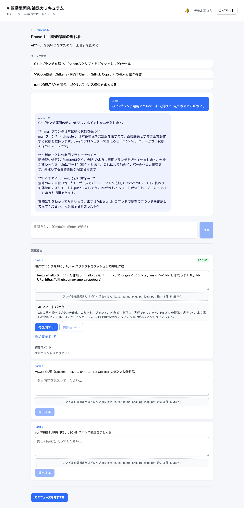

# Render + Supabase パイロット 運用 Runbook

公開デモ環境（Render + Supabase）を運用するシステム担当者向けの Day-2 運用手順書です。日常運用・監視・シークレット運用・障害対応をまとめます。

- **初回構築手順:** [render-demo.md](./render-demo.md)（このドキュメントの前提）
- **本番（AWS）系:** [production-deploy.md](./production-deploy.md) / [ecs-fargate.md](./ecs-fargate.md) / [alb-deploy.md](./alb-deploy.md)
- **CI:** [github-ci-setup.md](./github-ci-setup.md)

> 対象はあくまで**少人数デモ向けのパイロット**です。本番 SLA を満たす構成ではありません（単一インスタンス・Free DB・スリープあり）。

---

## 1. システム構成（概要）

| リソース | 種別 / プラン | 役割 |
|---|---|---|
| `edu-demo-web` | Render Static Site | Vue フロントエンド |
| `edu-demo-api` | Render Web Service (Docker, Starter) | FastAPI バックエンド・1 インスタンス |
| `submission-uploads` | Render Persistent Disk 1 GB（`/app/uploads`） | 提出ファイル保管 |
| Supabase project | Supabase Free（Singapore） | PostgreSQL + pgvector |

| 識別子 | 値 |
|---|---|
| Render API service ID | `srv-d8qvr0ugvqtc73eb6kjg` |
| Supabase project ref | `njaxokacfeokzhgbmdeq` |
| Region | Singapore |
| 想定固定費 | 約 `$7.25/月` + Anthropic API 利用料 + 超過帯域 |

### 公開エンドポイント

| 用途 | URL |
|---|---|
| フロント | <https://edu-demo-web.onrender.com> |
| API | <https://edu-demo-api.onrender.com> |
| ヘルスチェック | <https://edu-demo-api.onrender.com/healthz> |
| 稼働リビジョン | <https://edu-demo-api.onrender.com/version> |

### デモ向けの縮退構成（`render.yaml`）

| 環境変数 | 値 | 意味 |
|---|---|---|
| `CLAUDE_STUB_MODE` | `false` | 本物の Anthropic を使用（採点・チャット） |
| `EMBEDDING_STUB_MODE` | `true` | embedding はスタブ。semantic search 品質は評価対象外 |
| `GRADING_ASYNC_ENABLED` | `false` | 採点は API プロセス内で**同期**実行（Redis/worker 不要） |
| `CURRICULUM_CACHE_PUBSUB_ENABLED` | `false` | カリキュラムキャッシュの pub/sub 無効（単一インスタンス前提） |
| `SCHEDULED_BROADCAST_CRON_ENABLED` | `false` | 予約 broadcast worker 無効 |
| `UPLOAD_STORAGE_BACKEND` / `UPLOAD_DIR` | `local` / `/app/uploads` | アップロードは Render disk |
| `RATE_LIMIT_ENABLED` | `true` | レート制限有効 |

シークレット（`sync: false` で Render に手動設定）: `DATABASE_URL`, `ANTHROPIC_API_KEY`, `CORS_ALLOW_ORIGINS`, （web）`VITE_API_BASE_URL`。`JWT_SECRET_KEY` は Render が自動生成。

---

## 2. 監視・ヘルスチェック

### 日常確認（30 秒）

```bash
API=https://edu-demo-api.onrender.com
curl -sf -o /dev/null -w 'healthz: %{http_code}\n' "$API/healthz"
curl -s "$API/version"                       # 稼働中の commit / branch
curl -sf -o /dev/null -w 'catalog: %{http_code}\n' "$API/api/courses/catalog"
curl -sf -o /dev/null -w 'web: %{http_code}\n' https://edu-demo-web.onrender.com
```

- `/healthz` が `200 {"status":"ok"}` ならアプリ起動 OK。
- `/version` の `commit` が想定リビジョン（`git rev-parse HEAD`）と一致すれば最新デプロイが live。
- Render Dashboard → サービス → **Logs / Metrics / Events** で詳細を確認。

> ⏳ **コールドスタート:** 無アクセスが続くとインスタンスがスリープし、初回応答に 30〜60 秒かかります。監視で一時的に遅い/失敗が出たら、リトライで復帰するか確認してください（外形監視を入れるならタイムアウトを長めに）。

### 正常時のアプリ画面例

スモークテストで「正常」と判断できる状態の参考。AI チャットと採点が動いていれば、Anthropic 連携・DB・アップロードまで含めて健全です。



> 注: Render Dashboard / Logs は運用者の Render アカウントでのみ閲覧できるため、本 Runbook には画像を掲載していません。Dashboard → 対象サービス → **Logs / Events / Metrics / Environment** を参照してください。受講者画面の各スクリーンショットは [../demo/new-engineer-demo-guide.md](../demo/new-engineer-demo-guide.md) にあります。

---

## 3. ルーティン運用

### 3-1. デプロイ（通常は自動）

`render.yaml` は **`autoDeployTrigger: checksPass`**。`main` への push → **GitHub Actions CI 成功** → Render が自動デプロイします。

デプロイ時のシーケンス（backend）:
1. Docker image build
2. `preDeployCommand: uv run alembic upgrade head`（マイグレーション）
3. backend 起動（`uvicorn app.main:app`）
4. 初回のみ `initialDeployHook: uv run python -m scripts.seed_embeddings`
5. `/healthz` ヘルスチェック

**反映確認:** Render Events が "Deploy live" になり、`/version` の `commit` が更新されていれば完了。

```bash
# CI 監視（gh CLI）
gh run list --branch main --limit 3
gh run watch <RUN_ID> --exit-status

# デプロイ反映を /version でポーリング
target=$(git rev-parse HEAD)
until curl -s https://edu-demo-api.onrender.com/version | grep -q "${target:0:7}"; do sleep 20; done; echo live
```

> コード変更を伴わない再デプロイ（環境変数変更など）では `commit` は変わりません。その場合は Render Events で確認します。

### 3-2. 手動デプロイ / ロールバック

- **手動デプロイ:** Render Dashboard → `edu-demo-api` → **Manual Deploy**（最新コミット or 過去コミット選択）。
- **ロールバック:** Render Events から過去の成功デプロイを **Rollback**。または `git revert` → push（CI 経由で再デプロイ）。

### 3-3. データベースマイグレーション

`preDeployCommand` で毎デプロイ時に `alembic upgrade head` が自動実行されます。手動で確認/実行する場合は Render Shell（`edu-demo-api`）で:

```bash
uv run alembic current     # 現在のリビジョン
uv run alembic upgrade head
```

> ⚠️ 破壊的マイグレーション（カラム削除等）は事前に Supabase のバックアップを取ってから。Free プランはバックアップ制約があるため、重要操作前に `pg_dump` を手元に取得することを推奨。

### 3-4. 管理者への昇格

通常登録したユーザーを管理者にするには Render Shell（`edu-demo-api`）で:

```bash
uv run python -m scripts.promote_admin admin@example.com
```

### 3-5. 環境変数・シークレットの変更

Render Dashboard → `edu-demo-api` → **Environment** → 値を編集 → **Save Changes**（自動で再デプロイ）。`DATABASE_URL` / `ANTHROPIC_API_KEY` / `CORS_ALLOW_ORIGINS` などが対象。

---

## 4. シークレット運用

### 4-1. Anthropic API キーのローテーション

漏えい疑い・定期更新時の手順:

1. **Anthropic Console**（<https://console.anthropic.com/settings/keys>）で**新しいキーを発行**（旧キーはまだ消さない）。
2. Render → `edu-demo-api` → Environment → `ANTHROPIC_API_KEY` を**新キーで上書き** → Save（自動再デプロイ）。
3. 再デプロイ完了後、**チャット動作を検証**（後述 §6 の検証スニペット）。
4. 動作確認できたら **Anthropic Console で旧キーを失効（Delete/Revoke）**。

> ✅ **キー値の改行/空白はコード側で自動除去されます**（`app/config.py` の `normalize_api_key`）。Render の textarea で末尾に改行が入っても問題ありません。とはいえ貼り付けは1行を推奨。
>
> 🔐 ローカル開発キーと本番キーは**分離**してください。共用キーを本番ログで露出させると、失効がローカル開発も巻き込みます。ローカルキーは repo 直下 `.env`（gitignore 済み）に置きます。

### 4-2. その他のシークレット

- `JWT_SECRET_KEY` は Render 自動生成。**変更すると既存の発行済みトークンが全て無効化**（全ユーザー再ログイン）。
- `DATABASE_URL` 変更時は Supabase の Transaction Pooler（port `6543`）＋ `prepared_statement_cache_size=0` 付きであることを必ず確認（§6 参照）。

---

## 5. バックアップ・データ

| 対象 | 方法 |
|---|---|
| DB（Supabase） | Supabase Dashboard のバックアップ機能（Free は制約あり）。重要操作前に `pg_dump "$DATABASE_URL"` を手元取得 |
| 提出ファイル | Render Persistent Disk（`/app/uploads`、1 GB）。Render Disk の Snapshot 機能で取得可。容量逼迫時は古い提出を整理 |

> ⚠️ Render Disk は**単一インスタンスにのみマウント**されます。複数インスタンス化や S3 移行（`UPLOAD_STORAGE_BACKEND=s3`）はスケール時の課題（§7）。

---

## 6. 障害対応プレイブック

### 6-1. チャット/採点が 502（`upstream LLM error`）

**症状:** `POST /api/chat` や提出採点が `502 {"detail":"upstream LLM error"}`。

**切り分け:** Render Logs で `Anthropic chat completion failed` のスタックトレースを確認。

| ログの根本例外 | 原因 | 対処 |
|---|---|---|
| `httpx.LocalProtocolError: Illegal header value` → `APIConnectionError` | API キーに不正文字（改行等） | キー値を確認し再設定。※現行コードは改行を自動除去するため、再発時はキー自体の破損を疑う |
| `anthropic.APIStatusError` 401/403 | キーが無効/失効 | 有効なキーへローテーション（§4-1） |
| `anthropic.RateLimitError` 429 | レート/クレジット上限 | Anthropic 側の利用状況・残高を確認 |
| `APIConnectionError`（上記以外） | ネットワーク/一時障害 | 時間をおいて再試行。継続するなら Anthropic ステータス確認 |

**検証スニペット（キー設定後の動作確認）:**

```bash
API=https://edu-demo-api.onrender.com; COURSE=ai-driven-dev
EMAIL="ops-check-$(date +%s)@example.com"; PASS="OpsCheck-pw-12345"
curl -s -X POST "$API/api/auth/register" -H 'Content-Type: application/json' \
  -d "{\"email\":\"$EMAIL\",\"name\":\"Ops\",\"password\":\"$PASS\",\"course_slug\":\"$COURSE\"}" >/dev/null
TOKEN=$(curl -s -X POST "$API/api/auth/login" -H 'Content-Type: application/json' \
  -d "{\"email\":\"$EMAIL\",\"password\":\"$PASS\"}" | python3 -c "import sys,json;print(json.load(sys.stdin)['access_token'])")
curl -s -o /dev/null -w 'chat: %{http_code}\n' -X POST "$API/api/chat?course=$COURSE" \
  -H 'Content-Type: application/json' -H "Authorization: Bearer $TOKEN" \
  -d '{"phase":1,"message":"動作確認です。1+1は？"}'
```

`chat: 200` なら復旧。（検証用ダミーアカウントが DB に残る点に注意。）

### 6-2. DB 接続エラー（起動失敗 / 5xx）

**背景:** Supabase へは **Transaction Pooler（Supavisor, port `6543`）** のみ利用可。Direct 接続・Session Pooler（5432）はローカル/Render から不可。

**チェックリスト:**
- `DATABASE_URL` が `...pooler.supabase.com:6543/...` か。
- 末尾に `?prepared_statement_cache_size=0` が付いているか。
- アプリは `NullPool` + asyncpg prepared statement 名を UUID 化済み（`app/db/session.py` / `app/config.py`）。これは Supavisor の prepared statement 名衝突回避のため。**コード側の対策なので通常は触らない。**
- Supabase project が一時停止していないか（Free は無操作で pause されることがある → Dashboard で Restore）。
- pgvector 拡張が有効か（`vector`）。

### 6-3. サービスが遅い / 最初だけ失敗する

単一 Starter インスタンス＋スリープのため、コールドスタートで初回 30〜60 秒。継続的に遅い場合は Render Metrics で CPU/メモリ・同時接続を確認。恒常的な負荷ならプラン増強かインスタンス追加（→ §7 の制約に注意）。

### 6-4. デプロイ失敗

| 失敗箇所 | 確認 |
|---|---|
| CI が赤 | `gh run view <RUN_ID> --log-failed`。CI が通らない限り自動デプロイされない |
| `preDeployCommand`（migration）失敗 | Render Events/Logs で alembic エラー確認。DB 接続 or マイグレーション不整合 |
| 起動後すぐクラッシュ | Logs を確認。多くは env 不足/不正（`anthropic_api_key is required` 等の起動時バリデーション） |
| ヘルスチェック不通 | `/healthz` に到達できているか、ポート `$PORT` バインドか |

### 6-5. アップロード関連

- ファイルが弾かれる: 対応拡張子（py/java/js/ts/txt/md/png/jpg/jpeg/pdf）・5 MB/ファイル・3 ファイル/提出の上限。
- ディスク容量逼迫: Render Disk 1 GB。`du -sh /app/uploads`（Render Shell）で確認し、不要提出を整理。

---

## 7. スケール時の制約・既知の限界

このパイロットは意図的に縮退しています。利用拡大時は以下が課題になります。

- **単一インスタンス前提:** 複数インスタンス化するなら `CURRICULUM_CACHE_PUBSUB_ENABLED=true`（Redis 必須）にしないとカリキュラムキャッシュがインスタンス間で不整合。
- **同期採点:** `GRADING_ASYNC_ENABLED=false` のため、採点中は API リクエストがブロックされる。負荷が増えたら Redis + worker（arq）で非同期化。
- **アップロードが Render Disk:** 複数インスタンスで共有不可。`UPLOAD_STORAGE_BACKEND=s3` へ移行が必要。
- **embedding スタブ:** semantic search 品質は評価不可。本番品質には実 embedding モデルへ切替。
- **Supabase Free / 予約 broadcast 無効:** 規模・機能拡大時は有料プラン・worker 有効化を検討。

本格運用は AWS 系（[production-deploy.md](./production-deploy.md) / [ecs-fargate.md](./ecs-fargate.md)）への移行を想定。

---

## 8. セキュリティ運用

- **シークレットはコード非保持:** すべて Render の環境変数（`sync: false`）。`.env` は gitignore 済み。
- **キー露出時:** 即ローテーション（§4-1）。ログ/スクショ共有時はキーをマスク。
- **HTTP セキュリティヘッダ:** フロントは `X-Content-Type-Options: nosniff` / `X-Frame-Options: DENY` / `Referrer-Policy: strict-origin-when-cross-origin`（`render.yaml`）。API は CSP（`default-src 'none'`）。
- **レート制限:** `RATE_LIMIT_ENABLED=true`。提出・管理者書き込み等にレート制限あり。
- **CORS:** `CORS_ALLOW_ORIGINS` をフロントの公開 URL に限定。
- **JWT:** `JWT_SECRET_KEY` 漏えい時はローテーション（全ユーザー再ログインになる点に注意）。

---

## 9. 運用チェックリスト

**日次（任意）**
- [ ] `/healthz` 200 / `/version` が想定 commit
- [ ] `/api/courses/catalog` 200・フロント 200
- [ ] Render Logs にエラー多発がないか

**デプロイ時**
- [ ] CI 成功を確認（`gh run watch`）
- [ ] Render Events が "Deploy live"
- [ ] `/version` の commit 更新を確認
- [ ] スモーク（登録→ログイン→チャット→提出採点）

**障害時**
- [ ] Render Logs で根本例外を特定（§6 の表で分類）
- [ ] 影響範囲（全断 / チャットのみ / DB のみ）を切り分け
- [ ] 対処後、§6-1 の検証スニペットで復旧確認
- [ ] 必要なら `HANDOFF_*.md` / 本 Runbook に記録

---

## 付録: よく使うコマンド

```bash
# 稼働確認
curl -s https://edu-demo-api.onrender.com/healthz
curl -s https://edu-demo-api.onrender.com/version

# CI
gh run list --branch main --limit 3
gh run watch <RUN_ID> --exit-status
gh run view <RUN_ID> --log-failed

# render.yaml 検証（ローカル）
make render-validate
render blueprints validate render.yaml   # Render CLI 導入時

# DB 接続設定テスト（ローカル）
cd backend && uv run pytest tests/test_database_url.py -q

# Render Shell（edu-demo-api）でのオペレーション
uv run alembic current
uv run alembic upgrade head
uv run python -m scripts.promote_admin admin@example.com
du -sh /app/uploads
```
