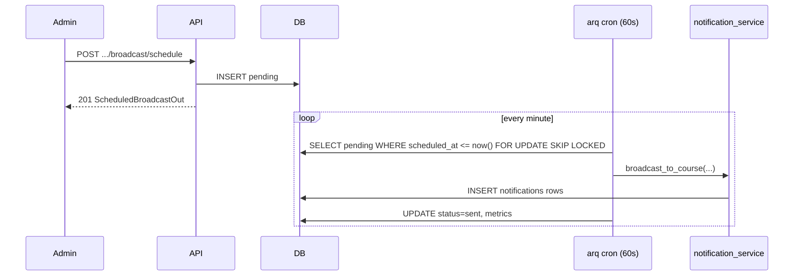

# Sprint 11 — 予約 broadcast 通知 アーキテクチャ設計

**作成日:** 2026-06-11
**前提 HEAD:** `5e744e3` (Sprint 10 完了 + CI public 化)
**前提テスト:** backend 426 passed / frontend 100 passed / E2E 6 passed

---

## 1. ゴールと非目標

### ゴール

admin が **コース一斉通知** を即時送信に加え、**指定日時に自動配信**できるようにする。Sprint 7 LOW-4 の `broadcast_to_course` と Sprint 8 の arq worker を再利用し、運用者が「月曜 9:00 に Phase 2 開始リマインド」などを UI から予約できる。

### 含むもの (in-scope)

1. **DB** — `scheduled_broadcasts` テーブル（pending / sent / cancelled / failed）
2. **Backend service** — 予約 CRUD + 配信実行（既存 `broadcast_to_course` 委譲）
3. **arq cron** — 1 分間隔で due な pending 行を処理（Redis job 消失に耐える）
4. **Admin API**
   - `POST /api/admin/notifications/broadcast/schedule` — 予約作成
   - `GET /api/admin/notifications/scheduled` — 予約一覧（pending + 直近 sent）
   - `DELETE /api/admin/notifications/scheduled/{id}` — pending のみキャンセル
5. **Admin frontend** — `AdminNotifyView` に「予約一斉送信」タブ + 予約一覧
6. **テスト** — service + API + worker job 単体（cron は job 関数を直接呼ぶ）

### 含まないもの (out-of-scope)

- 個別通知 (1:1) の予約 — broadcast のみ
- メール / Slack 等の外部チャネル
- 繰り返し配信 (cron 式 RRULE)
- タイムゾーン UI（admin は **JST 入力 → UTC 保存**、表示は `toLocaleString('ja-JP')`）
- Sprint 9 LOW-2 multi-worker cache invalidation（別 track）
- Sprint 10 follow-ups LOW（別 PR 可）
- ai-era-se Phase 2-4 投入 — **Sprint 9 migration + Sprint 7 LOW-1 で DB 投入済み**。本 sprint では対象外

### 非機能要件

- backend 426 / frontend 100 / E2E 6 を regression ゼロ維持
- 新規 backend ≈12 件、frontend ≈4 件、E2E 1 件（schedule smoke、worker stub）
- `scheduled_at` は **未来のみ** 受付（即時は既存 `/broadcast` を使用）
- 最小予約 lead time: **5 分**（config `scheduled_broadcast_min_lead_minutes`）
- 最大予約 horizon: **90 日**（config `scheduled_broadcast_max_horizon_days`）
- idempotent 配信 — 同一行を二重処理しても `sent` 行はスキップ

---

## 2. データモデル

### `scheduled_broadcasts`

| 列 | 型 | 説明 |
|----|-----|------|
| `id` | UUID PK | |
| `sender_user_id` | FK users RESTRICT | 予約した admin |
| `course_id` | FK courses RESTRICT | 対象コース |
| `title` | varchar(200) | |
| `body` | text | |
| `link` | varchar(500) nullable | 既存 link バリデーション再利用 |
| `scheduled_at` | timestamptz | UTC、配信予定 |
| `status` | varchar(20) | `pending` / `sent` / `cancelled` / `failed` |
| `sent_at` | timestamptz nullable | 実配信完了時 |
| `sent_count` | int nullable | `BroadcastResult.sent_count` |
| `skipped_inbox_full` | int nullable | |
| `skipped_admin` | int nullable | |
| `failure_reason` | text nullable | `failed` 時 |
| `created_at` | timestamptz | |

**Index:** `(status, scheduled_at)` where status = pending（due スキャン用）

### 状態遷移

```
pending ──(due + job success)──► sent
pending ──(admin DELETE)───────► cancelled
pending ──(job exception)──────► failed
```

`sent` / `cancelled` / `failed` は終端。再実行 API は Sprint 11 では提供しない。

---

## 3. 配信フロー



- cron job 名: `process_due_scheduled_broadcasts`
- 1 回の tick で最大 **10 件** 処理（config `scheduled_broadcast_batch_size`）
- `SELECT ... FOR UPDATE SKIP LOCKED` で multi-worker 安全（将来複数 worker でも二重配信防止）

---

## 4. API 設計

### `POST /api/admin/notifications/broadcast/schedule`

**Body:** `BroadcastScheduleCreate`

```python
course_slug: str
title: str  # 1..200
body: str   # 1..2000
link: str | None  # 既存 BroadcastNotificationCreate と同 validator
scheduled_at: datetime  # ISO8601、aware UTC または offset 付き
```

**Responses:**
- 201 `ScheduledBroadcastOut`
- 422 unknown course / past time / lead time violation / horizon violation
- 429 rate limit（既存 admin_write_rate_limit）

### `GET /api/admin/notifications/scheduled`

**Query:** `status: pending | sent | cancelled | failed | all` (default `pending`)
**Limit:** 50（固定で十分）

### `DELETE /api/admin/notifications/scheduled/{id}`

- pending のみ → 200 `{ "status": "cancelled" }`
- それ以外 → 409 conflict

---

## 5. Frontend

`AdminNotifyView.vue` の mode を 3 タブ化:

| タブ | 動作 |
|------|------|
| 個別送信 | 既存 |
| 即時一斉 | 既存 `/broadcast` |
| **予約一斉** | `datetime-local` 入力 + schedule API |

予約一覧セクション（pending 強調、sent は直近 10 件）。キャンセルボタンは pending のみ。

型: `frontend/src/types/notification.ts` に `ScheduledBroadcastOut` 等を追加。

---

## 6. Worker / Config

`backend/app/config.py` 追加:

```python
scheduled_broadcast_min_lead_minutes: int = 5
scheduled_broadcast_max_horizon_days: int = 90
scheduled_broadcast_batch_size: int = 10
scheduled_broadcast_cron_enabled: bool = True  # tests: False
```

`WorkerSettings.cron_jobs`:

```python
cron(process_due_scheduled_broadcasts, minute={0,1,...,59})  # 毎分
```

テストでは `scheduled_broadcast_cron_enabled=false` と job 関数の直接呼び出し。

---

## 7. テスト方針

| 層 | 件数 | 要点 |
|----|------|------|
| service | 6 | create / cancel / process due / idempotent / failed |
| API | 5 | 201 / 422 past / 409 cancel sent / list filter |
| worker | 1 | process_due with frozen time |
| frontend vitest | 2 | schedule form validation mock |
| E2E | 1 | admin schedule → stub worker または API assert only |

E2E は CI で worker が動かないため、**予約作成 + GET で pending 確認**まで（配信本体は backend テストで担保）。

---

## 8. リスクと緩和

| リスク | 緩和 |
|--------|------|
| worker 停止で配信遅延 | cron + DB が source of truth。worker 再起動後に due 分を追いつく |
| admin タイムゾーン誤解 | UI ラベル「日本時間 (JST)」+ datetime-local を JST 解釈して UTC 送信 |
| 大量 broadcast | 既存 inbox cap / skip ロジックそのまま。結果を scheduled 行に記録 |

---

## 9. 完了条件

- [ ] Alembic migration 適用
- [ ] admin が予約作成・一覧・キャンセル可能
- [ ] due 到達で notifications 行が作成される（手動 / テスト job 呼び出しで確認）
- [ ] backend 438+ / frontend 104+ / E2E 7+ passed
- [ ] HANDOVER 更新
